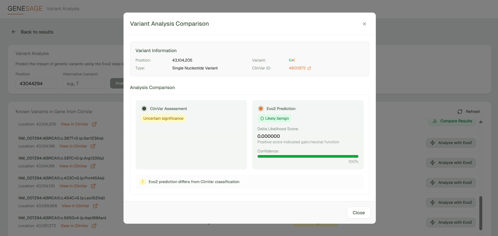

# GeneSage

A genomic variant analysis platform that uses NVIDIA's **Evo2** deep-learning model to predict the pathogenicity of single nucleotide variants (SNVs). Browse genes, view DNA sequences, and analyze variants against ClinVar annotations — all from a modern web interface.

🔗 **[Live Demo →](https://genesage.vercel.app/)**




## Architecture

```
┌──────────────────────────────┐       ┌─────────────────────────────────┐
│       Frontend (Next.js)     │       │     Backend (Modal + Evo2)      │
│                              │       │                                 │
│  page.tsx                    │       │  main.py                        │
│   ├─ GeneViewer              │       │   ├─ Evo2Model (H100 GPU)      │
│   │   ├─ VariantAnalysis  ───┼──POST─┼───├─ analyze_single_variant()  │
│   │   ├─ KnownVariants       │       │   ├─ run_brca1_analysis()      │
│   │   ├─ GeneSequence        │       │   └─ get_genome_sequence()     │
│   │   └─ GeneInformation     │       │                                 │
│   └─ VariantComparisonModal  │       └─────────────────────────────────┘
│                              │
│  External APIs:              │
│   ├─ UCSC Genome Browser     │
│   └─ NCBI Gene / ClinVar    │
└──────────────────────────────┘
```

## Features

- **Gene Search & Browsing** — Search by gene symbol or browse by chromosome using NCBI and UCSC APIs
- **Interactive Sequence Viewer** — Color-coded nucleotide display with a custom dual-handle range slider (up to 10,000 bp window)
- **AI Variant Analysis** — Click any nucleotide, specify an alternative, and get an Evo2-powered pathogenicity prediction with confidence scores
- **ClinVar Integration** — View known clinical variants for any gene, run Evo2 analysis on them, and compare predictions side-by-side with ClinVar classifications
- **Dark-Themed UI** — Modern dark interface built with shadcn/ui components and a custom CSS variable system

## Tech Stack

| Layer | Technology |
|-------|-----------|
| Frontend | Next.js 15, React 19, TypeScript, Tailwind CSS 4, shadcn/ui |
| Backend | Python, Modal (serverless GPU), FastAPI |
| AI Model | NVIDIA Evo2 7B (DNA foundation model) |
| APIs | UCSC Genome Browser, NCBI E-utilities, NCBI ClinVar |
| Deployment | Vercel (frontend), Modal (backend on H100 GPU) |

## Prerequisites

- **Python 3.10+**
- **Node.js 20+** and **npm**
- A [Modal](https://modal.com) account (for GPU backend)
- A Modal API token (run `modal setup` after install)

## Getting Started

### 1. Clone the repository

```bash
git clone https://github.com/letbrocode/genesage.git
cd genesage
```

### 2. Backend setup

```bash
# Create and activate a virtual environment
cd backend
python -m venv .venv

# Windows
.venv\Scripts\activate
# macOS/Linux
source .venv/bin/activate

# Install dependencies
pip install -r requirements.txt

# Authenticate with Modal
modal setup

# Deploy the backend to Modal
modal deploy main.py
```

After deploying, Modal will output a URL for the `analyze_single_variant` endpoint. Copy this URL — you'll need it for the frontend.

### 3. Frontend setup

```bash
cd ../frontend

# Copy the environment template
cp .env.example .env
```

Edit `.env` and set the Modal endpoint URL:

```env
NEXT_PUBLIC_ANALYZE_SINGLE_VARIANT_BASE_URL="https://your-modal-username--genesage-evo2model-analyze-single-variant.modal.run"
```

```bash
# Install dependencies
npm install

# Start the development server
npm run dev
```

The app will be available at [http://localhost:3000](http://localhost:3000).

## Project Structure

```
genesage/
├── backend/
│   ├── main.py              # Modal app — Evo2 model, variant analysis endpoint
│   ├── requirements.txt     # Python dependencies
│   └── evo2/                # Evo2 model submodule
├── frontend/
│   ├── src/
│   │   ├── app/
│   │   │   ├── page.tsx     # Home page — gene search & browse
│   │   │   └── layout.tsx   # Root layout with fonts & theme
│   │   ├── components/
│   │   │   ├── gene-viewer.tsx              # Central gene orchestrator
│   │   │   ├── variant-analysis.tsx         # Evo2 variant analysis form
│   │   │   ├── known-variants.tsx           # ClinVar variants table
│   │   │   ├── gene-sequence.tsx            # Interactive DNA sequence viewer
│   │   │   ├── gene-information.tsx         # Gene metadata card
│   │   │   ├── variant-comparison-modal.tsx # ClinVar vs Evo2 comparison
│   │   │   └── ui/                          # shadcn/ui primitives
│   │   ├── utils/
│   │   │   ├── genome-api.ts    # All external API integrations
│   │   │   └── coloring-utils.ts # Nucleotide & classification colors
│   │   ├── styles/
│   │   │   └── globals.css      # Theme CSS variables (dark/light)
│   │   └── env.js               # Environment variable validation
│   ├── .env.example
│   └── package.json
├── walkthrough.md           # Detailed codebase walkthrough
└── README.md
```

## How It Works

1. **Search** for a gene (e.g., "BRCA1") or browse by chromosome
2. **View** the DNA sequence with color-coded nucleotides — click any base to select it
3. **Analyze** a variant by specifying an alternative nucleotide
4. The frontend sends a request to the **Modal backend**, which:
   - Fetches an 8,192 bp reference window from UCSC
   - Scores both reference and variant sequences through **Evo2 7B**
   - Computes a delta likelihood score and classifies as pathogenic/benign
5. **Compare** Evo2 predictions against ClinVar clinical annotations

## Deployment

### Frontend (Vercel)

Connect the `frontend/` directory to Vercel and set the `NEXT_PUBLIC_ANALYZE_SINGLE_VARIANT_BASE_URL` environment variable in your Vercel dashboard.

### Backend (Modal)

The backend auto-deploys to Modal with `modal deploy main.py`. The model stays warm for 120 seconds between requests to minimize cold starts.

## Environment Variables

| Variable | Location | Description |
|----------|----------|-------------|
| `NEXT_PUBLIC_ANALYZE_SINGLE_VARIANT_BASE_URL` | `frontend/.env` | Modal endpoint URL for the Evo2 variant analysis API |


