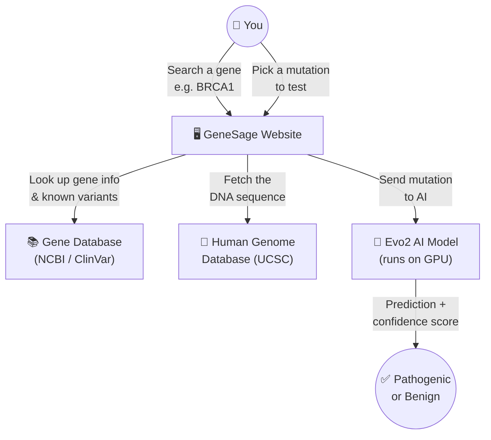
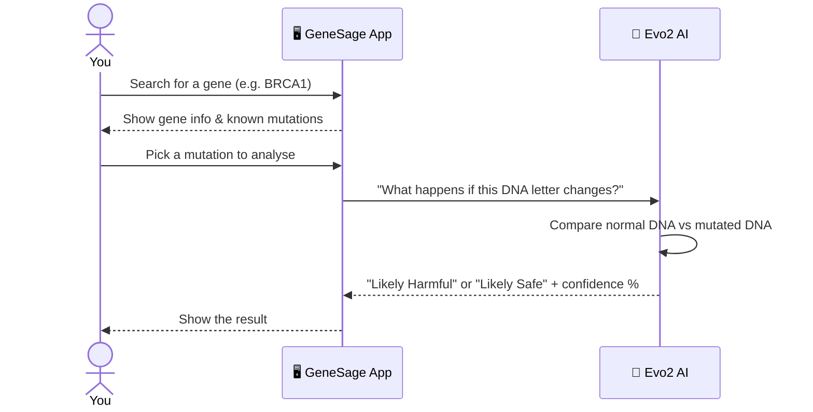

# GeneSage — How It Works (Simplified)

## System Overview

```mermaid
graph TD
    User(("👤 You"))
    Website["🖥️ GeneSage Website"]
    GeneDB["📚 Gene Database\n(NCBI / ClinVar)"]
    GenomeDB["🧬 Human Genome\nDatabase (UCSC)"]
    AI["🤖 Evo2 AI Model\n(runs on GPU)"]
    Result(("✅ Pathogenic\nor Benign"))

    User -->|"Search a gene\ne.g. BRCA1"| Website
    Website -->|"Look up gene info\n& known variants"| GeneDB
    Website -->|"Fetch the\nDNA sequence"| GenomeDB
    User -->|"Pick a mutation\nto test"| Website
    Website -->|"Send mutation\nto AI"| AI
    AI -->|"Prediction +\nconfidence score"| Result
```

---

## Step-by-Step: What Happens When You Test a Mutation

```mermaid
sequenceDiagram
    actor You
    participant App as 🖥️ GeneSage App
    participant AI as 🤖 Evo2 AI

    You->>App: Search for a gene (e.g. BRCA1)
    App-->>You: Show gene info & known mutations

    You->>App: Pick a mutation to analyse
    App->>AI: "What happens if this DNA letter changes?"
    AI->>AI: Compare normal DNA vs mutated DNA
    AI-->>App: "Likely Harmful" or "Likely Safe" + confidence %
    App-->>You: Show the result
```
