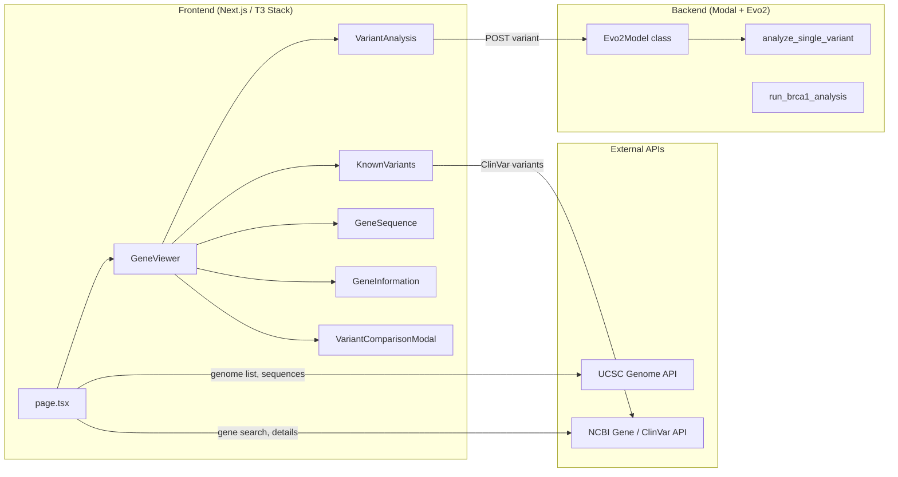
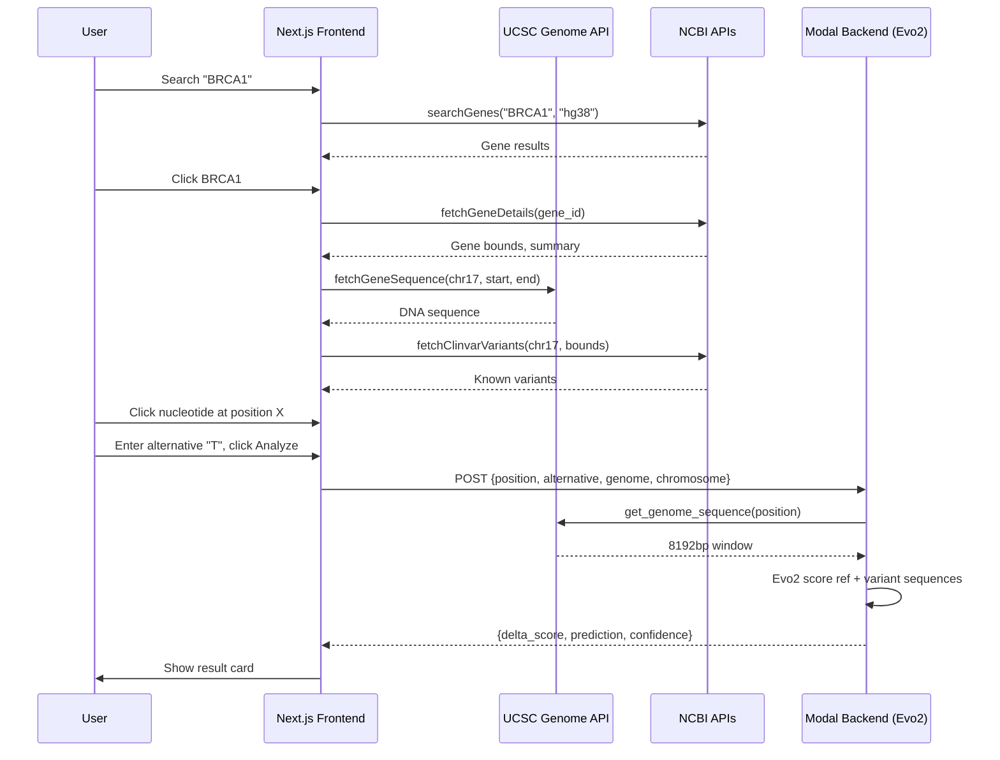

# GeneSage — Codebase Walkthrough

GeneSage is a **genomic variant analysis platform** that uses NVIDIA's **Evo2** deep-learning model to predict the pathogenicity of single nucleotide variants (SNVs). It has two major parts: a **Python/Modal backend** for GPU inference and a **Next.js (T3 Stack) frontend** for browsing genes and analyzing variants.

---

## Architecture Overview

---

## Backend — `backend/`

### [main.py](file:///d:/Projects/genesage/backend/main.py) (368 lines)

The entire backend lives in a single file, deployed as a **Modal** serverless app on an **H100 GPU**.

| Component | Lines | Purpose |
|---|---|---|
| [VariantRequest](file:///d:/Projects/genesage/backend/main.py#7-12) | 7–11 | Pydantic model: `variant_position`, `alternative`, [genome](file:///d:/Projects/genesage/backend/main.py#221-255), `chromosome` |
| `evo2_image` | 13–28 | Modal Docker image built from `nvcr.io/nvidia/pytorch:25.04-py3` with [evo2](file:///d:/Projects/genesage/backend/main.py#288-294) and data-science deps |
| [run_brca1_analysis()](file:///d:/Projects/genesage/backend/main.py#36-195) | 37–194 | Batch BRCA1 variant scoring — loads the full Evo2 7B model, scores 500 variants from an Excel dataset, computes AUROC, and returns a base64 plot + variant records |
| [get_genome_sequence()](file:///d:/Projects/genesage/backend/main.py#221-255) | 221–254 | Fetches a window of reference sequence from the **UCSC Genome Browser API** |
| [analyze_variant()](file:///d:/Projects/genesage/backend/main.py#257-284) | 257–283 | Pure function: scores ref vs. variant sequence with Evo2, computes delta score, classifies as "Likely pathogenic" or "Likely benign" using a hardcoded threshold (`-0.0009178519`) derived from the BRCA1 calibration |
| [Evo2Model](file:///d:/Projects/genesage/backend/main.py#286-341) class | 286–340 | Modal `@app.cls` — keeps the model warm (`max_containers=1`, `scaledown_window=120`). Exposes [analyze_single_variant](file:///d:/Projects/genesage/backend/main.py#296-341) as a **FastAPI POST endpoint** |
| [main()](file:///d:/Projects/genesage/backend/main.py#343-368) | 343–367 | Local entrypoint that calls the deployed endpoint with a sample BRCA1 variant |

**Key design notes:**
- The model is loaded **once** via `@modal.enter()` and reused across requests
- Classification confidence is computed as `distance_from_threshold / class_std_dev`, capped at 1.0
- The BRCA1 analysis function is a standalone batch pipeline (separate from the single-variant API)

### [requirements.txt](file:///d:/Projects/genesage/backend/requirements.txt)
`fastapi`, `modal`, `matplotlib`, `pandas`, `seaborn`, `scikit-learn`, `openpyxl`

### `backend/evo2/`
A Git submodule / vendored copy of the [Evo2 model repo](https://github.com/ArcInstitute/evo2) (not application code).

---

## Frontend — `frontend/`

A **T3 Stack** app: Next.js 15, React 19, Tailwind CSS 4, TypeScript, shadcn/ui components.

### Entry Point

#### [page.tsx](file:///d:/Projects/genesage/frontend/src/app/page.tsx) (389 lines)

The home page — a single-page app with two modes:

| Mode | Description |
|---|---|
| **Search** | Type a gene symbol (e.g. "BRCA1") → search via NCBI API → show results table |
| **Browse** | Pick a chromosome → list genes on that chromosome |

Clicking a gene row opens `GeneViewer`. The page also loads available genome assemblies from UCSC and chromosome lists.

#### [layout.tsx](file:///d:/Projects/genesage/frontend/src/app/layout.tsx)
Root layout with Geist font and global CSS.

---

### Components

#### [gene-viewer.tsx](file:///d:/Projects/genesage/frontend/src/components/gene-viewer.tsx) (287 lines)

**The central orchestrator.** When a gene is selected:
1. Fetches gene details (bounds, summary) from NCBI
2. Loads the initial DNA sequence window from UCSC
3. Fetches known ClinVar variants for the gene
4. Renders the four sub-panels: `VariantAnalysis`, `KnownVariants`, `GeneSequence`, `GeneInformation`

Manages state for sequence position, ClinVar variants, and the comparison modal. Clicking a nucleotide in the sequence viewer auto-fills the variant analysis position.

#### [variant-analysis.tsx](file:///d:/Projects/genesage/frontend/src/components/variant-analysis.tsx) (363 lines)

**Evo2 single-variant analysis form.** User enters a position + alternative nucleotide → calls the Modal backend → displays:
- Delta likelihood score
- Pathogenic/Benign prediction with confidence bar
- If the position matches a known ClinVar SNV, shows a "Known Variant Detected" card with a quick-analyze button

Uses `forwardRef` + `useImperativeHandle` so the parent can focus the alternative input when a nucleotide is clicked in the sequence viewer.

#### [known-variants.tsx](file:///d:/Projects/genesage/frontend/src/components/known-variants.tsx) (254 lines)

Table of ClinVar variants for the current gene. Each SNV row has an "Analyze with Evo2" button. After analysis, shows the Evo2 prediction inline and enables a "Compare Results" button that opens the comparison modal.

#### [gene-sequence.tsx](file:///d:/Projects/genesage/frontend/src/components/gene-sequence.tsx) (445 lines)

Interactive DNA sequence browser:
- **Custom dual-handle range slider** for selecting a sub-region within gene bounds (max 10,000 bp)
- Color-coded nucleotides (A=red, T=blue, G=green, C=amber)
- Hover tooltip showing genomic position
- Click a nucleotide → populates the variant analysis form
- Supports drag-to-pan on the selected range

#### [gene-information.tsx](file:///d:/Projects/genesage/frontend/src/components/gene-information.tsx) (119 lines)

Read-only card displaying gene metadata: symbol, name, chromosome, position range, strand, gene ID (linked to NCBI), organism, and summary.

#### [variant-comparison-modal.tsx](file:///d:/Projects/genesage/frontend/src/components/variant-comparison-modal.tsx) (240 lines)

Side-by-side comparison of **ClinVar classification** vs. **Evo2 prediction** for a variant:
- Shows agreement/disagreement indicator
- Delta score, confidence bar, and links back to ClinVar

---

### Utilities

#### [genome-api.ts](file:///d:/Projects/genesage/frontend/src/utils/genome-api.ts) (382 lines)

All external API integrations:

| Function | API | Purpose |
|---|---|---|
| `getAvailableGenomes()` | UCSC | List all human genome assemblies |
| `getGenomeChromosomes()` | UCSC | List chromosomes for a genome (filters out patches/unmapped) |
| `searchGenes()` | NCBI Clinical Tables | Search genes by symbol/name, returns top 10 |
| `fetchGeneDetails()` | NCBI E-utilities | Get gene bounds, strand, summary |
| `fetchGeneSequence()` | UCSC | Get DNA sequence for a chromosomal range |
| `fetchClinvarVariants()` | NCBI E-utilities | Search + fetch ClinVar variants within gene bounds (max 20) |
| `analyzeVariantWithAPI()` | Modal backend | POST to Evo2 endpoint for variant prediction |

#### [coloring-utils.ts](file:///d:/Projects/genesage/frontend/src/utils/coloring-utils.ts) (28 lines)

Two helpers: `getNucleotideColorClass()` (A/T/G/C → Tailwind color) and `getClassificationColorClasses()` (pathogenic→red, benign→green, uncertain→yellow).

#### [env.js](file:///d:/Projects/genesage/frontend/src/env.js)

T3 env validation via `@t3-oss/env-nextjs`. Key env var: `NEXT_PUBLIC_ANALYZE_SINGLE_VARIANT_BASE_URL` — the Modal endpoint URL.

---

### UI Primitives — `components/ui/`

6 shadcn/ui components: `button`, `card`, `input`, `select`, `table`, `tabs`.

---

## Design & Color Palette

| Token | Value | Usage |
|---|---|---|
| Primary green | `#3c4f3d` | Headers, buttons, text |
| Accent orange | `#de8246` | Brand accent, links, GENESAGE logo |
| Background | `#e9eeea` | Page background, selected states |
| Surface | `white` | Cards |

---

## Data Flow: Analyzing a Variant

